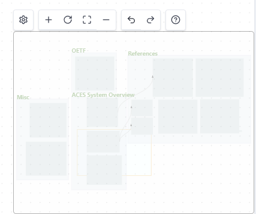

# Obsidian Canvas Minimap Plugin

Canvas in Obsidian is a nice tool for capturing and visualizing ideas. However, with the growth of canvas notes, it becomes hard to navigate and easy to get lost.

This plugin provides a minimap for canvas notes, which can help you navigate and get an overview of the canvas.

## Usage
- Enable the minimap via the command palette or the settings.
- By clicking on the minimap, you can navigate to the corresponding position in the canvas.
    - Navigation behavior can be customized in the settings.
- Profit!

## Note
Obsidian does not provide a public API for plugins to access canvas object. This plugin uses a workaround to achieve the goal, which may not be stable and may break in the future.
